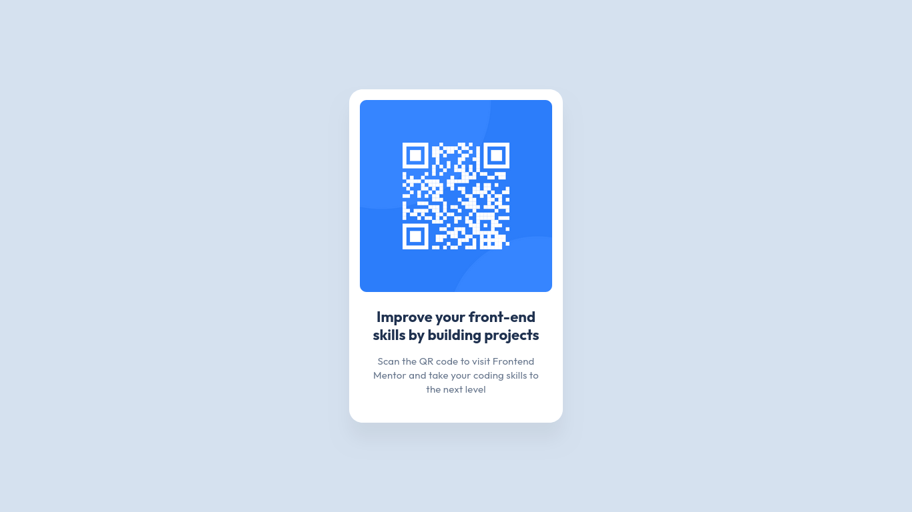

# Frontend Mentor - QR code component solution

This is a solution to the [QR code component challenge on Frontend Mentor](https://www.frontendmentor.io/challenges/qr-code-component-iux_sIO_H). Frontend Mentor challenges help you improve your coding skills by building realistic projects. 

## Table of contents

- [Overview](#overview)
  - [Screenshot](#screenshot)
  - [Links](#links)
- [My process](#my-process)
  - [Built with](#built-with)
  - [What I learned](#what-i-learned)
  - [Continued development](#continued-development)
- [Author](#author)


## Overview

This project is a simple **QR code card component** built with HTML and CSS.  
It was created as part of the Frontend Mentor QR Code Component Challenge, designed to help practice basic layout and styling techniques.  

The component consists of:  
- A QR code image  
- A title heading  
- A short description  

The main objectives of this project were to:  
- Create a centered, responsive card layout.  
- Apply consistent spacing, rounded corners, and shadows.  
- Use semantic HTML5 and clean CSS styling.

### Screenshot




### Links

- Solution URL: [Add solution URL here](https://your-solution-url.com)
- Live Site URL: [Add live site URL here](https://your-live-site-url.com)

## My process

### Built with

- Semantic **HTML5** markup  
- **CSS3** (Flexbox, custom properties)  
- Mobile-first workflow 

### What I learned

I practiced structuring a simple component with semantic HTML and styling it with modern CSS.  
I also improved my understanding of Flexbox centering and creating a clean card layout. 


```html
<h1>Some HTML code I'm proud of</h1>
```
```css
.card {
  display: flex;
  flex-direction: column;
  align-items: center;
}

```

### Continued development

In the future, I want to:

- Explore more responsive design techniques.

- Add accessibility improvements like more descriptive alt text.

- Try converting this into a reusable component in a larger project.


## Author

- Frontend Mentor - [NxtCreator](https://www.frontendmentor.io/profile/NxtCreator)
- GitHub - [NxtCreator](https://github.com/NxtCreator)

